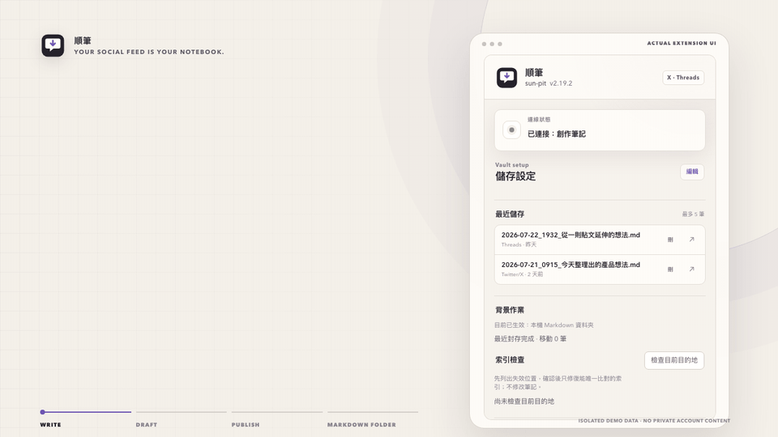

<p align="center">
  
</p>

<h1 align="center">sun-pit · 順筆</h1>

<p align="center">
  <a href="README.md">繁體中文</a> · <strong>English</strong>
</p>

<p align="center">
  <strong>Your social feed is your notebook.</strong><br>
  Write on X and Threads. Your thoughts become notes as you post.
</p>

<p align="center">
  <a href="https://chromewebstore.google.com/detail/sun-pit/jdfempgjnmdlokacfjmnpiphhghcnomb"></a>
  <a href="https://github.com/lostshin/sun-pit/stargazers"></a>
  <a href="https://github.com/lostshin/sun-pit/actions/workflows/validate.yml"></a>
  <a href="LICENSE"></a>
</p>



The 20-second demo uses the actual extension popup with isolated sample data; it does not contain private account content. A high-resolution version is available as [MP4](assets/demo.mp4).

## Use social media as your note-taking app

Sometimes a blank notebook gives you nothing to write, while a post in your feed brings a whole idea to mind. If social media is already where you write, it can be where you take notes too.

**sun-pit makes posting and taking notes the same action.** Write your own thoughts on X or Threads, then add to them in a thread. After you publish, sun-pit saves the text, thread, and static images to your chosen Markdown folder, Obsidian Vault, or Apple Notes, with the source and time attached.

The name 順筆 means writing as your thoughts come and keeping a note along the way. Stay in the social app while you write; return to your notes when you want to find, organize, or develop an idea. There is no separate copy-and-paste step after each post.

The project grew out of AuDHD needs: switching tools and remembering to organize things later can interrupt a thought. Letting notes build up through an existing writing habit removes one more thing to remember.

## What you get

- Published X and Threads posts become Markdown notes or Apple Notes automatically.
- Individual posts, multi-post threads, and static images are preserved in their original order.
- When saved as Markdown, each post has its own copyable code block.
- Source URLs, timestamps, reply context, quoted posts, and thread counts stay with the writing.
- Drafts are saved automatically, and interrupted saves retry to their original destination.
- The popup lets you preview, open, or delete drafts and recent saves.
- There is no third-party JavaScript, developer backend, telemetry, or advertising.

## Supported setups

| Destination | Supported environment | Requirements and capabilities |
| --- | --- | --- |
| Local Markdown folder (recommended) | macOS + Google Chrome | Included open-source Native Helper; any writable folder, no `.obsidian`, plugin, or API key required |
| Apple Notes | macOS + Google Chrome | Uses the system Notes automation interface; published posts, attachments, three-day reply merging, open, delete, and offline retry |
| Obsidian Local REST API | macOS, Windows, Linux + Google Chrome | Obsidian community plugin [Local REST API](https://github.com/coddingtonbear/obsidian-local-rest-api) and an API key |

Only the Local REST API destination requires [Obsidian](https://obsidian.md/). One destination is active at a time. The Native Helper currently supports macOS only.

## Install

The working tree is the 2.19.3 release candidate; the store and existing releases may still use the previous name and package filenames.

### Install from the Chrome Web Store

1. Install [sun-pit from the Chrome Web Store](https://chromewebstore.google.com/detail/sun-pit/jdfempgjnmdlokacfjmnpiphhghcnomb).
2. To use the recommended Native Helper on macOS, download `sun-pit-helper-v*-macos.zip` from the matching [GitHub Release](https://github.com/lostshin/sun-pit/releases).
3. Extract the archive and run:

   ```bash
   ./native/install-host.sh jdfempgjnmdlokacfjmnpiphhghcnomb
   ```

Chrome Web Store extensions cannot install local programs automatically. If you prefer not to install the Helper, choose Local REST API in the popup instead.

### Install manually from a GitHub Release

1. Download and extract `sun-pit-v*.zip` from [Releases](https://github.com/lostshin/sun-pit/releases) into a permanent folder.
2. Open `chrome://extensions/`, enable **Developer mode**, choose **Load unpacked**, and select the folder containing `manifest.json`.
3. On macOS, install the Native Helper from that folder:

   ```bash
   ./native/install-host.sh
   ```

4. Reload the extension, open its popup, and choose a storage destination.

Chrome cannot load a ZIP directly. Keep the extracted folder in the same location when updating a manual installation, or the extension ID, settings, and Native Helper authorization may change.

Detailed update and removal instructions are currently available in [Traditional Chinese](INSTALL.md).

## Configure and use

1. Pin the extension to the Chrome toolbar and open its popup.
2. Local Markdown folder: choose any writable folder, including an Obsidian Vault if desired.
3. Apple Notes: explicitly choose an account and folder. “On My Mac” stays local; an iCloud account follows Apple’s sync settings.
4. Local REST API: enter the API key and HTTP port `27123` or HTTPS port `27124`, then test the connection.
5. Adjust note and media paths for Markdown or REST if needed, then save.
6. Refresh any open X or Threads tabs, then write and publish as usual.

The popup separates unpublished drafts from recent saves. Open and delete actions are routed to the item’s original destination and never delete the social post.

## What gets saved

The default note folder is `個人創作/社群推文`, and the default media folder is `附件/順筆`:

```text
個人創作/社群推文/
└── 2026-07-18_1100_圖片同步測試.md

附件/順筆/
└── 2026-07-18_1100_圖片同步測試/
    ├── image-01.jpg
    └── image-02.webp
```

Notes use standard relative Markdown links that resolve from the note location. If an individual image download fails, the text note is still saved and keeps the remote image URL.

## Privacy and permissions

All post data stays between services and software chosen by the user:

```text
X / Threads tab
  → Chrome extension
  → macOS Native Helper or 127.0.0.1 Local REST API
  → a Markdown folder, Apple Notes, or an Obsidian Vault (one at a time)
```

- `storage`: stores destination settings, full local drafts in Apple Notes mode, the offline queue, and recent-save metadata.
- `nativeMessaging`: communicates with the user-installed macOS Helper.
- `notifications`: reports a completed published-post save when the originating tab no longer exists.
- `alarms`: retries the offline queue and maintains Vault activity state.
- X and Threads access: handles only posts the user is drafting or has just published and their related source context.
- X and Meta media CDN access: downloads static images from those posts.
- `127.0.0.1`: connects to the local Obsidian REST API plugin only when that mode is selected.
- Apple Notes: the Helper requests macOS Automation access only when this destination is selected. Choosing an iCloud account means Apple may sync the notes.

There is no developer-operated server, remote code, data sale, or data sharing. See the [Privacy Policy](PRIVACY.md) for details.

## Known limitations

- The Native Helper currently supports macOS and Google Chrome only. Windows, Linux, and other Chromium browsers can use Local REST API or contribute platform support.
- Only static images are downloaded; videos and animated GIFs are not synchronized.
- Internal X and Threads APIs can change. Remove API keys, cookies, private post content, and full platform responses before reporting parser issues.
- Threads image URLs use expiring signatures, so long offline periods may leave only remote URLs.
- Apple Notes attachments are kept in order at the end of the note; inline placement, native tags, and seven-day archiving are not supported.
- On an iCloud Markdown folder, macOS may ask for permission to let Ruby or Chrome control Finder the first time a note is deleted.

## Roadmap

Project direction is tracked openly with the [`roadmap` label](https://github.com/lostshin/sun-pit/issues?q=state%3Aopen%20label%3Aroadmap). Current explorations include:

- [Native Helper support for Windows and Linux](https://github.com/lostshin/sun-pit/issues/2)
- [Chromium-based browser compatibility](https://github.com/lostshin/sun-pit/issues/3)
- [Local preservation of videos and animated GIFs](https://github.com/lostshin/sun-pit/issues/4)
- [Browser-level smoke tests for release packages](https://github.com/lostshin/sun-pit/issues/5)
- [Joplin Data API](https://joplinapp.org/help/api/references/rest_api/) is the next storage-provider candidate; [Bear CLI](https://bear.app/faq/command-line-interface/) follows it.

Roadmap issues describe desired outcomes, not promised release dates. Evidence from real workflows takes priority over feature count.

## Development, testing, and releases

The project uses native JavaScript, HTML, CSS, and macOS system Ruby. It has no build step or npm dependencies.

```bash
node scripts/validate-extension.mjs
node tests/media-sync.test.mjs
./scripts/package-extension.sh
git diff --check
```

The packaging script creates:

- `sun-pit-v<version>.zip`: manual GitHub installation and Chrome Web Store package.
- `sun-pit-helper-v<version>-macos.zip`: macOS Helper for Store users.
- `SHA256SUMS`: SHA-256 checksums for both archives.

See [CONTRIBUTING.md](CONTRIBUTING.md) before contributing. Chrome Web Store fields, permission justifications, and review instructions are documented in [docs/CHROME_WEB_STORE.md](docs/CHROME_WEB_STORE.md).

## Support and license

- Bugs and feature requests: [GitHub Issues](https://github.com/lostshin/sun-pit/issues)
- Security reports: [SECURITY.md](SECURITY.md)
- License: [MIT](LICENSE)

This is an independent open-source project and is not sponsored, endorsed, or maintained by X, Meta, Threads, Obsidian, or their affiliates.

If this tool saves you a context switch and helps you keep more of your writing, consider starring the repository so others looking for a lower-friction workflow can find it.
